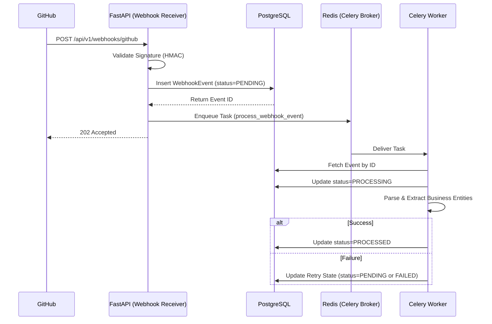
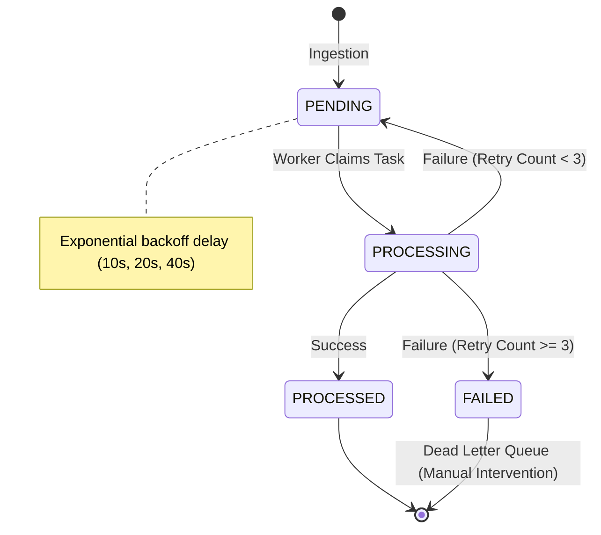
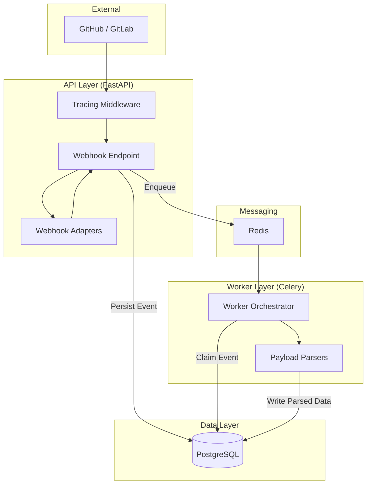

# NexusIQ Architecture Documentation

## Event Flow Diagram

This diagram shows how webhooks flow from external services through the API to background processing, demonstrating the decoupled ingestion layer.

## Retry Flow and Dead Letter Queue (DLQ)

This state diagram models the lifecycle of a single WebhookEvent, demonstrating fault tolerance.

## Component Architecture

