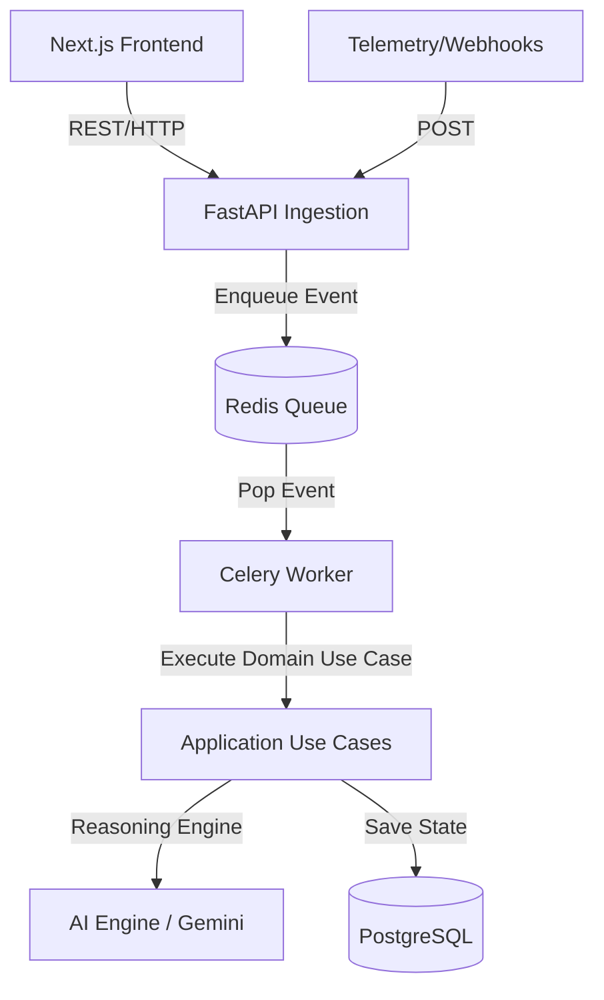
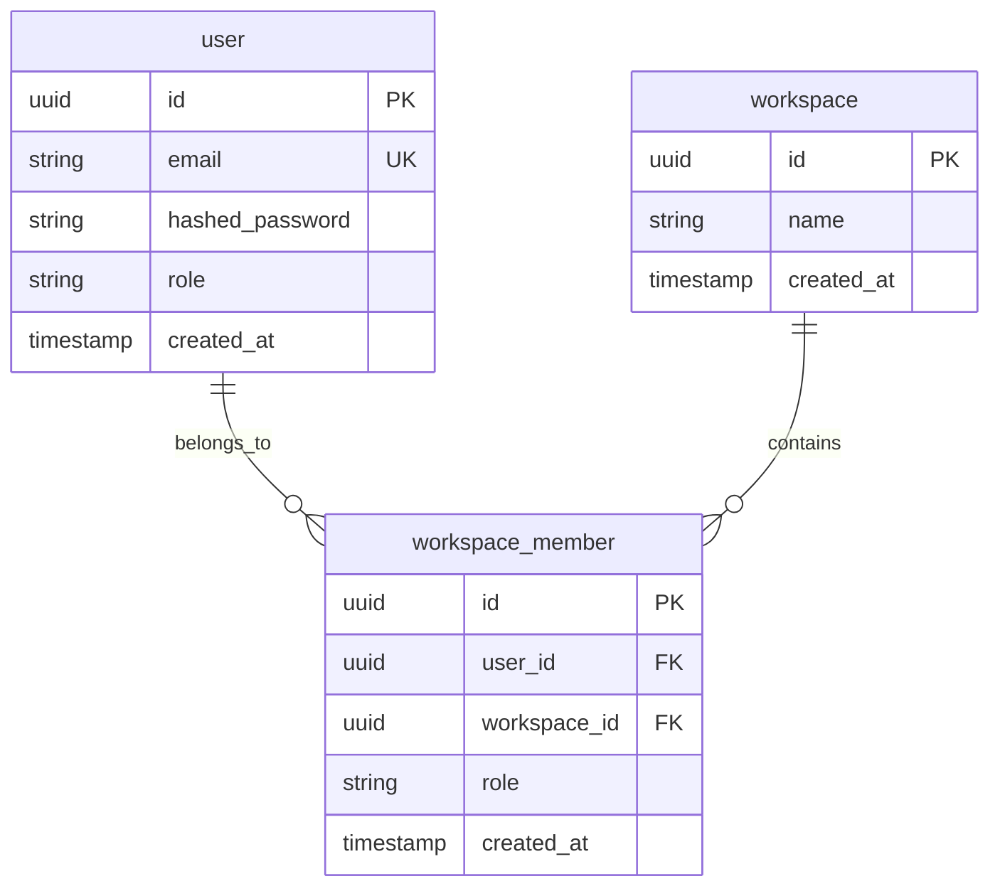

# NexusIQ: AI-Powered Engineering Intelligence Platform

NexusIQ is a modular, event-driven engineering intelligence platform that aggregates engineering metadata from multiple sources (GitHub, deployment systems, API telemetry) and applies Large Language Models (LLMs) to synthesize actionable insights.

Instead of displaying passive dashboards, NexusIQ acts as an automated engineering copilot to help teams understand **why** anomalies occur and **what** actions to take next.

---

## 1. System Architecture

NexusIQ adopts **Clean Architecture** patterns to isolate framework-specific implementations (FastAPI, Next.js, Celery, SQLAlchemy) from core domain logic.



### Clean Architecture Layout:
*   `app/domain`: Houses core entities (`User`, `Workspace`) and domain rules. Framework-free.
*   `app/application`: Contains orchestrators and application-specific use cases.
*   `app/infrastructure`: Implements adapters for database connections, redis configurations, and email clients.
*   `app/ai_engine`: Isolated intelligence module managing prompts and LLM reasoning.
*   `app/api`: Handles FastAPI routes, security dependencies, and Pydantic validation schemas.

---

## 2. Technology Stack
*   **Backend:** FastAPI (Python 3.11) with Uvicorn.
*   **Database:** PostgreSQL 16 managed via SQLAlchemy 2.0 (using `asyncpg` for asyncio database I/O) and Alembic migrations.
*   **Message Broker:** Redis 7.
*   **Task Ingestion:** Celery.
*   **Frontend:** Next.js (TypeScript, React, Tailwind CSS).
*   **AI Engine:** Gemini API.

---

## 3. Database Design



---

## 4. API Endpoints Reference

### Authentication Routing (`/api/v1/auth`)
*   `POST /register`: Registers a new user. Returns user metadata.
*   `POST /login`: Receives standard OAuth2 Form parameters, validates credentials, and returns a signed stateless JWT Access Token.
*   `GET /me`: Returns the validated user object matching the JWT.

### Workspace Routing (`/api/v1/workspaces`)
*   `POST /`: Creates a new workspace and registers the current logged-in user as the `OWNER`.
*   `GET /`: Lists all workspaces the user has access to.

---

## 5. Development Setup

### Prerequisites
*   Python 3.8+ (Python 3.11 recommended)
*   Docker & Docker Compose

### Local Development (Manual Mode)
1.  **Clone the repository:**
    ```bash
    git clone https://github.com/your-username/nexus-iq.git
    cd nexus-iq
    ```

2.  **Initialize Backend Virtual Environment:**
    ```bash
    cd backend
    python -m venv venv
    source venv/bin/activate  # On Windows: .\venv\Scripts\activate
    pip install -r requirements-dev.txt
    ```

3.  **Run Migrations:**
    ```bash
    alembic upgrade head
    ```

4.  **Launch Dev Server:**
    ```bash
    uvicorn app.main:app --reload
    ```

5.  **Run Unit & Integration Tests:**
    ```bash
    pytest
    ```

### Containerized Environment (Docker Compose)
To launch the entire platform (Postgres, Redis, Backend, Workers, Next.js Frontend) in unified containers:
```bash
docker compose up --build -d
```
The FastAPI backend will bind to `http://localhost:8000` and the Next.js frontend to `http://localhost:3000`.
